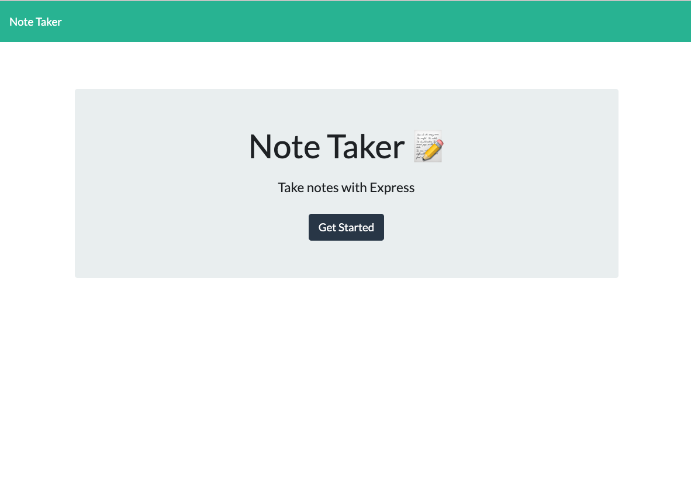
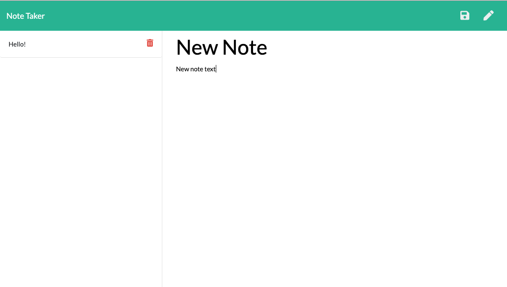

[](https://opensource.org/licenses/MIT)

# Note Taker

## Table of Contents (Optional)
* [Description](#Description)
* [Installation](#Installation)
* [Instructions](#Instructions)
* [Questions](#Questions)
* [License](#License)

---

## Description

The Note Taker is a simple Node application that helps the user keep track of notes. The user is able to create notes by adding a title and note body text, as well as delete notes.

---

## Installation

Heroku App
1. No installation is required when using the Heroku App (link: https://shrouded-ravine-14551.herokuapp.com/)

Local Node server
1. Clone the repository to your local drive
1. Open the folder location and run ```npm install``` to install all Node modules.
1. Start the node server using ```node server.js``` and navigate to localhost:8080 in your browser.

---

## Instructions
1. Begin by clicking "Get Started"



2. Click the pencil in the top right corner of the screen to create a new note.

3. Add a custom Title and Text to your note and then click the save icon in the top right corner.



4. View saved notes by clicking on the corresponding note on the left.

5. Delete notes by clicking the red trashcan next to the corresponding note.

---

## Questions

* My github: https://github.com/zehrl
* Email me at zehrl315@outlook.com if you have any questions.

---

## License

Copyright 2021 Logan J. Zehr

Permission is hereby granted, free of charge, to any person obtaining a copy of this software and associated documentation files (the "Software"), to deal in the Software without restriction, including without limitation the rights to use, copy, modify, merge, publish, distribute, sublicense, and/or sell copies of the Software, and to permit persons to whom the Software is furnished to do so, subject to the following conditions:

The above copyright notice and this permission notice shall be included in all copies or substantial portions of the Software.

THE SOFTWARE IS PROVIDED "AS IS", WITHOUT WARRANTY OF ANY KIND, EXPRESS OR IMPLIED, INCLUDING BUT NOT LIMITED TO THE WARRANTIES OF MERCHANTABILITY, FITNESS FOR A PARTICULAR PURPOSE AND NONINFRINGEMENT. IN NO EVENT SHALL THE AUTHORS OR COPYRIGHT HOLDERS BE LIABLE FOR ANY CLAIM, DAMAGES OR OTHER LIABILITY, WHETHER IN AN ACTION OF CONTRACT, TORT OR OTHERWISE, ARISING FROM, OUT OF OR IN CONNECTION WITH THE SOFTWARE OR THE USE OR OTHER DEALINGS IN THE SOFTWARE.